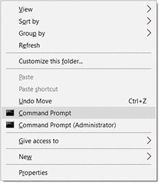

# cmd-start-menu (for Windows)

Provides the menu that can start "Command Prompt" on current directory.

Run `install.exe` or `uninstall.exe` to set up.
UAC prompt will appear on demand.

Tested on Windows 10 (x64)

## License

CC0 License

Authored by Retorillo, No Rights Reserved.
